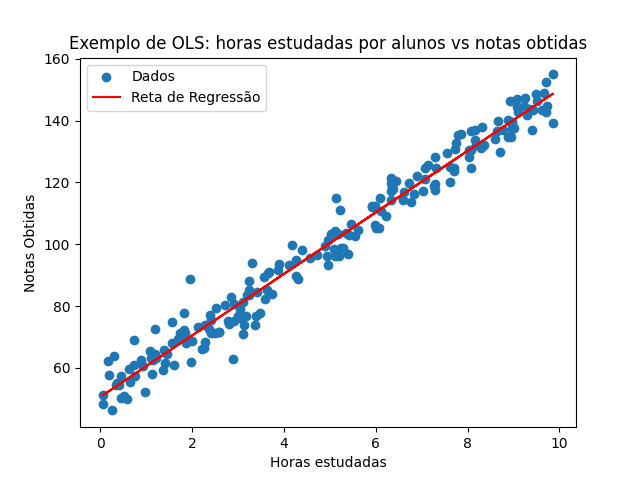
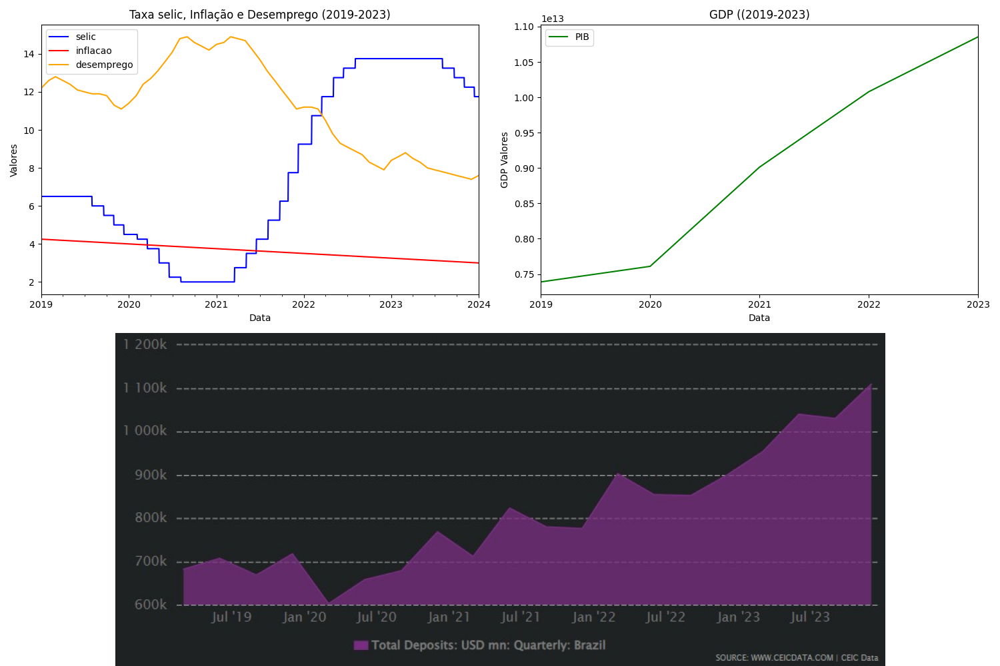

<h1> Pesquisa e Modelagem </h1>

Desenvolvimento de códigos em linguagem python para a extração de dados em API's externas, confecção de gráficos envolvendo conceitos de econometria e análise dos resultados obtidos:

O seguinte documento apresenta a análises das informações e resultados obtidos e os métodos utilizados para tal. 

<h2>Questão 1) </h2>

<LI>O método mínimo de quadrados ordenados (OLS, em inglës) se trata de uma técnica de regressão linear para identificação de relação entre variávies numéricas através de uma reta traçada. O objetivo dessa reta é ajustar os dados de maneira que a distancia entre os pontos observados e a linha seja mínima. 
A aplicação mais comum desse método é para planejamento de acordo com valores reais e valores previstos. 
Exemplo: 
<LI> Análise de dados, como prever o preço de uma casa com base na área em que ela se encontra.
<LI> Resolução do exercício:
Foi utilizada a regressão linear simples (OLS) para analisar como o tempo dedicado aos estudos influencia o desempenho dos alunos em uma prova. Os resultados indicam uma relação positiva: quanto mais horas estudadas, maior tende a ser a nota.

No entanto, nem todos os pontos se encaixam perfeitamente na reta de regressão. A distância entre cada ponto e a reta, chamada de resíduo, representa a diferença entre a nota real do aluno e a nota prevista pelo modelo. Esses resíduos podem ser explicados por diversos fatores não considerados no modelo.
É importante ressaltar que o modelo de regressão linear simples busca explicar a maior parte da variação nos dados.

<h2> Questão 2) </h2>

<h3>Gráfico Taxa Selic, inflação e Desemprego: </h3>
<LI> A análise do primeiro gráfico  revela um cenário econômico relativamente estável até o início de 2020, com taxas de desemprego, inflação e Selic consistentes. No entanto, a partir da surgimento da pandemia do COVID-19, observamos uma disrupção significativa nesses indicadores.

O desemprego obteve um crescimento acentuado, enquanto a taxa Selic sofreu uma redução drástica. Paralelamente, a inflação apresentou uma tendência de queda gradual. Esses comportamentos podem ser explicados pelos impactos socioeconômicos da pandemia, que afetaram tanto a oferta quanto a demanda na economia.

O aumento do desemprego, em linha com a Curva de Phillips, contribuiu para a contenção da inflação. Com a demanda enfraquecida, as empresas tiveram menor poder de repassar os custos para os preços finais, pressionando a inflação para baixo. Em conjunto a esse cenário, o Banco Central adotou uma política monetária expansionista, reduzindo a taxa Selic para estimular a atividade econômica.

Conforme a pandemia foi sendo controlada e a vacinação avançou no meio do ano de 2021, a economia começou a se recuperar, refletindo em uma redução gradual do desemprego e em um ajuste gradual da política monetária, com a taxa Selic voltando a subir. 

<h3> Relação com o Gráfico GPD: </h3>
<LI> Com a recuperação econômica pós-pandemia, tivemos um crescimento acentuado do PIB conforme demonstra o gráfico. Colocando os dois gráficos lado a lado podemos observar que a taxa SELIC aumentou da mesma forma acentuada que o PIB, esse cenário reflete a tentativa do Banco Central de conter a inflação, que pode ser pressionada pela maior demanda por crédito, impulsionada pela retomada da atividade econômica.

<h3>Relacionamento entre Inflação, desemprego e PIB com a atividade de depósitos totais:</h3>
<LI> Para interpretarmos o gráfico "Total Deposits: USD mn" precisamos entender que a confiança do consumidor desempenha um papel crucial na dinâmica dos depósitos bancários. Em períodos de alta incerteza econômica e social, a confiança é abalada, levando as pessoas a reduzirem seus gastos e a buscar a segurança da liquidez (recursos disponíveis para emergencias).
Tanto pessoas quanto empresas se tornam avessas aos riscos e priorizam a estabilidade, e não realizam depósitos em instituições financeiras.
Com a retomada da estabilidade, a confiança do consumidor retorna e este se sente estimulado a investir e movimentar os recursos que sobram, realizando um aumento no fluxo de depósitos. 
Como podemos analisar no gráfico, apartir da retomada da economia no meio do ano de 2021 os depósitos voltaram a subir, indicando uma retomada à estabilidade da economia.

A análise conjunta dos gráficos de desemprego, taxa Selic, PIB e depósitos revela um ciclo econômico interligado. Em períodos de crise, caracterizados por alta taxa de desemprego, a incerteza financeira leva as pessoas a priorizar a liquidez, reduzindo seus depósitos bancários. Em resposta a essa situação, o Banco Central costuma adotar uma política monetária expansionista, reduzindo a taxa Selic para estimular a economia e o crédito. Conforme a economia se recupera e o mercado de trabalho se fortalece, a confiança dos consumidores aumenta, incentivando-os a voltar a depositar seus recursos nos bancos.

<h3>Elaboração dos gráficos e pesquisa: </h3>
Foi utilizado a API do Banco Central para acesso aos dados que compõem os gráficos "Taxa Selic, inflação e Desemprego (2019-2023)" e "GDP (2019-2023)". 
O gráfico "Total Deposits: USD mn" foi retirado do site da Ceic Data, pois o acesso aos dados que compõem o gráfico são restritos a estudantes mediante pagamento. 
Foram utilizadas as bibliotecas:
<LI> Panda;
<LI> Matplotlib;
<LI> Numpy;
<LI> BCB;
<LI> Seaborn;
<LI> Statsmodels.

<h2>Questão 3) </h2>
Ao longo do desenvolvimento do código tive a oportunidade de aprimorar algumas habilidades minhas de análise de dados e organização de informações coletadas, sendo a parte mais empolgante: lidar com a API do Banco Central. 
A busca pelo número de séries exigiu um determinado tempo e aprofundamento teórico, expandindo meus conhecimentos sobre o tema. Com esse desafio, extrai insights valiosos acerca do tratamento, modelagem e análise de dados.

 